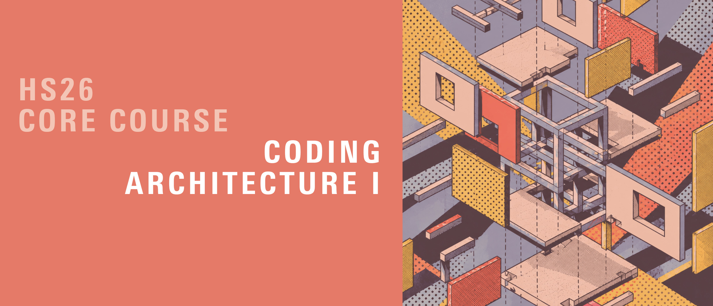
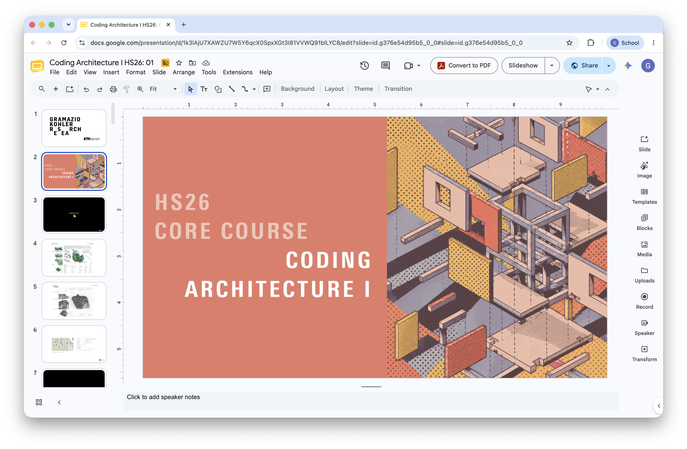
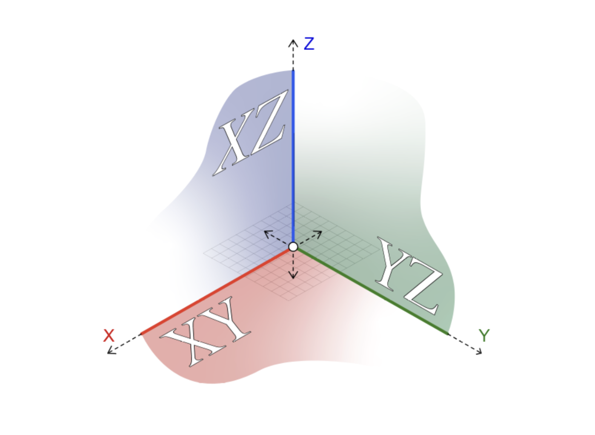
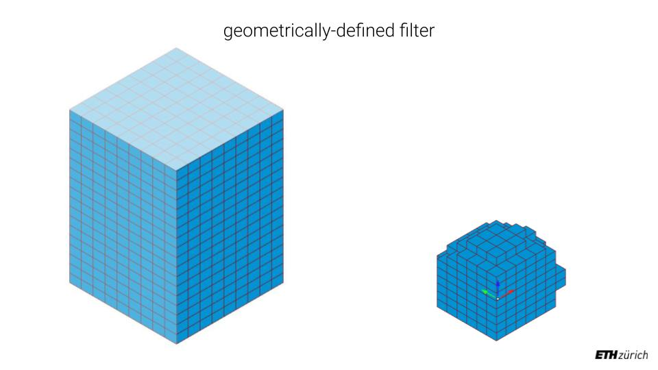
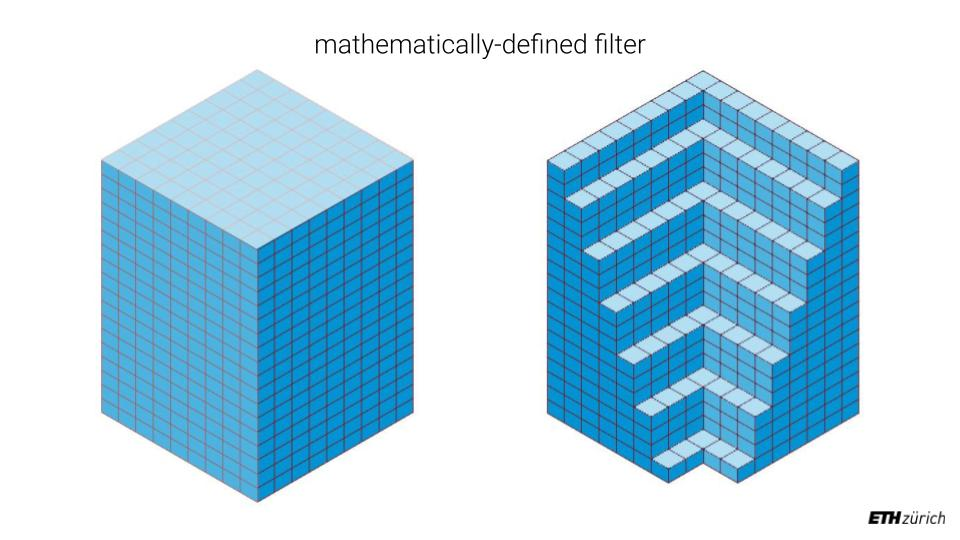
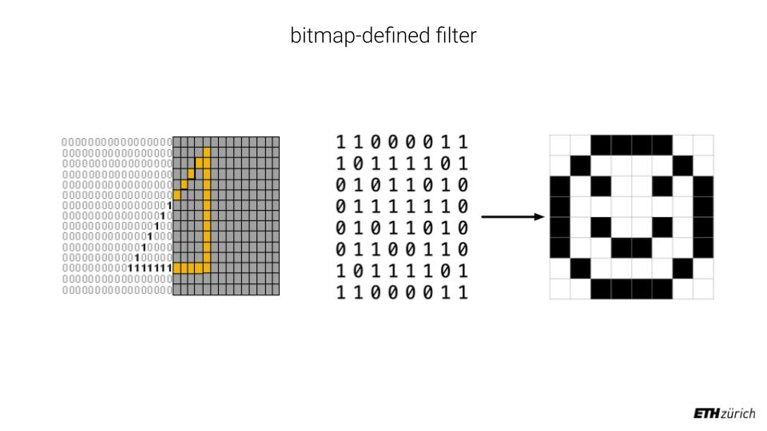

# Coding Architecture I: HS26

## Week 04 - Geometry and Filtering



## Table of Contents

* [Overview](#overview)
* [Slides](#slides)
* [Frames](#frames)
    + [Creating a Frame](#creating-a-frame)
    + [Oriented Boxes](#oriented-boxes)
    + [Transforming Frames](#transforming-frames)
* [Working with Boxes](#working-with-boxes)
    + [Constructors](#constructors)
    + [Attributes](#attributes)
    + [Moving a Box](#moving-a-box)
    + [Methods](#methods)
* [3D Grids](#3d-grids)
    + [From 2D to 3D](#from-2d-to-3d)
    + [A 3D Grid of Boxes](#a-3d-grid-of-boxes)
    + [Centering a Grid](#centering-a-grid)
* [Filtering](#filtering)
    + [Filter Functions](#filter-functions)
    + [Indices vs Coordinates](#indices-vs-coordinates)
    + [Modulo Filter](#modulo-filter)
    + [Random Filter](#random-filter)
    + [Geometric Filters](#geometric-filters)
    + [Mathematical Filters](#mathematical-filters)
    + [Bitmap Filter](#bitmap-filter)
    + [Filtering in Plain Python](#filtering-in-plain-python)
* [Code Examples](#code-examples)
* [Micro Exercises](#micro-exercises)

## Overview

This week’s lecture is a wrap-up aimed at consolidating your understanding of the key concepts covered so far. Before we dive into Object-Oriented Programming next week, we take the opportunity to finish our exploration of geometric types and give everyone time to catch up. So far we worked mostly in 2D: the boxes of the brick wall are 3D, but the wall itself is essentially a flat surface. Today we go into the third dimension:

- 3D Geometry: We finish our discussion of geometric types, focusing on the constructors, attributes and methods of boxes, and on frames, which position and orient geometry in space.
- 3D Grids: We extend our point grids into the third dimension and fill them with boxes.
- Filters: We introduce different ways of selecting parts of a grid: modulo, random, geometric, mathematical and bitmap-based filters.
- Weekly Quiz
- Tutored Session: The final part of the lecture is a hands-on session where you'll have time to ask questions and get help with your work.

Before we start, sync your local files in VS Code. Watch the video posted in the Moodle announcements if you haven't configured VS Code yet.

>**Learning Goals:** Strengthen understanding of computational geometry in 3D space.


## Slides

[](https://docs.google.com/presentation/d/1fjWZF2fzy6kEqYMDOJFseLSoWdgg1tR0z8M0AAYf3yk/edit?usp=drive_link)

<div style="display: flex; justify-content: center; align-items: center; height: 1vh;">
    <p style="font-size: 75%;">
        ↑ click to open ↑
    </p>
</div>

## Frames

Last week we saw that a `Box` is placed and oriented in space by its `Frame`. Let's look at frames in more detail.

The first frame you should be familiar with is the global coordinate system. Rhino operates within Euclidean space: a virtual 3D space, also known as the “World Coordinate System”, with three perpendicular axes labeled x, y, and z. The “Origin” (0, 0, 0) serves as the universal reference point for everything you create in Rhino and Grasshopper. It is immutable.



A frame is nothing else than a **local coordinate system**. It is defined by a base point (its origin) and two orthonormal base vectors (`xaxis` and `yaxis`). The Z axis is not given: it is computed to be at a right angle to both, following the right-hand rule. A frame therefore describes both a **location** and an **orientation** in space.

In COMPAS, frames are essential for defining the position and orientation of objects. They allow you to create custom coordinate systems for any object, giving precise control over transformations such as translation, rotation, and scaling.

### Creating a Frame

```python
# ----------------------------------
# --------- Creating Frames --------

from compas.geometry import Frame

# Define the origin point and axes for the frame
origin = [1, 2, 0]  # The frame's origin point in space
xaxis = [1, 0, 0]   # The X-axis direction of the frame
yaxis = [0, 1, 0]   # The Y-axis direction of the frame

frame = Frame(origin, xaxis, yaxis)

print(frame)
# Frame(point=Point(x=1.000, y=2.000, z=0.000), xaxis=Vector(x=1.000, y=0.000, z=0.000), yaxis=Vector(x=0.000, y=1.000, z=0.000))

# The Z axis is computed from the other two
print(frame.zaxis)  # Vector(x=0.000, y=0.000, z=1.000)
```

### Oriented Boxes

A box is always built along the axes of its frame, and the origin of the frame is the **center** of the box. If the frame is rotated, the box is rotated with it.

```python
# -------------------------------------------
# ----- Using Frames to Define Geometry -----

from compas.geometry import Box, Frame

# A frame at (2, 3, 0), aligned with the world axes
frame = Frame([2, 3, 0], [1, 0, 0], [0, 1, 0])
box = Box(2.0, 1.0, 0.6, frame)

print(box)
# Box(xsize=2.0, ysize=1.0, zsize=0.6, frame=Frame(point=Point(x=2.0, y=3.0, z=0.0), xaxis=Vector(x=1.0, y=0.0, z=0.0), yaxis=Vector(x=0.0, y=1.0, z=0.0)))

# A frame at the origin, turned 45 degrees around Z.
# The axes do not need to be unit vectors: COMPAS normalizes them.
frame = Frame([0, 0, 0], [1, 1, 0], [-1, 1, 0])
oriented_box = Box(2.0, 1.0, 0.6, frame)

print(oriented_box.frame.xaxis)  # Vector(x=0.707, y=0.707, z=0.000)
```

The `Helix` example in the Grasshopper file of this week takes this idea further: it computes a frame at every point along a helix, so that each box follows the direction of the curve.

### Transforming Frames

Frames can be transformed like any other geometry. A **translation** moves the origin and keeps the axes parallel. A **rotation** turns the axes around a center point.

```python
# ------------------------------------------------
# ----- Applying Transformations with Frames -----

import math
from compas.geometry import Frame, Rotation, Translation

frame = Frame([2, 5, 0], [1, 0, 0], [0, 1, 0])

# Translation: move by 3 units along X
T = Translation.from_vector([3, 0, 0])
frame_translated = frame.transformed(T)
print(frame_translated.point)  # Point(x=5.000, y=5.000, z=0.000)

# Rotation: 45 degrees around the Z axis, using the frame's own origin as center
R = Rotation.from_axis_and_angle([0, 0, 1], math.radians(45), point=frame.point)
frame_rotated = frame.transformed(R)
print(frame_rotated.point)  # Point(x=2.000, y=5.000, z=0.000) -> the origin stays
print(frame_rotated.xaxis)  # Vector(x=0.707, y=0.707, z=0.000) -> the axes turn

# Careful: without `point`, the rotation turns around the WORLD origin,
# so the frame's origin moves as well
R = Rotation.from_axis_and_angle([0, 0, 1], math.radians(45))
print(frame.transformed(R).point)  # Point(x=-2.121, y=4.950, z=0.000)
```

> COMPAS uses **radians** for angles. Use `math.radians()` to convert from degrees, or `math.pi` directly (`math.pi / 2` is 90 degrees).

## Working with Boxes

To find all the ways to construct, inspect and modify a `Box`, search for it in the [COMPAS API reference](https://compas.dev/compas/2.15.1/api/index.html) (see last week's section on how to read technical documentation). All the examples below are also in the Grasshopper file of this week.

### Constructors

```python
# -----------------------------------------
# --------- Basic Box Constructor ---------

from compas.geometry import Box

# A single value creates a cube
box = Box(1)
print(box.xsize, box.ysize, box.zsize)  # 1.0 1.0 1.0

# Three values set the size along X, Y and Z
box = Box(1, 2, 3)
print(box.xsize, box.ysize, box.zsize)  # 1.0 2.0 3.0

# -----------------------------------------
# ------ Box from Width, Height, Depth ----

from compas.geometry import Box

# Width is measured along X, height along Z and depth along Y,
# so the order of the values is different from Box(xsize, ysize, zsize)!
box = Box.from_width_height_depth(1, 2, 3)
print(box.xsize, box.ysize, box.zsize)  # 1.0 3.0 2.0

# -----------------------------------------
# ------ Box from Corner and Height -------

from compas.geometry import Box, Point

# Two opposite corners of the base, plus the height
corner1 = Point(0, 0, 0)
corner2 = Point(1, 1, 0)
box = Box.from_corner_corner_height(corner1, corner2, 2)

print(box.xsize, box.ysize, box.zsize)  # 1.0 1.0 2.0
print(box.frame.point)  # Point(x=0.500, y=0.500, z=1.000) -> the center

# -----------------------------------------
# ------- Box from Bounding Box -----------

from compas.geometry import Box

# The eight corner points of a box
bbox = [
    [0, 0, 0],
    [0, 1, 0],
    [1, 1, 0],
    [1, 0, 0],
    [0, 0, 1],
    [0, 1, 1],
    [1, 1, 1],
    [1, 0, 1],
]
box = Box.from_bounding_box(bbox)

print(box.xsize, box.ysize, box.zsize)  # 1.0 1.0 1.0
```

### Attributes

```python
# -----------------------------------------
# ------------- Box Attributes ------------

from compas.geometry import Box

box = Box(1, 2, 3)

# Size
print(box.xsize, box.ysize, box.zsize)   # 1.0 2.0 3.0
print(box.width, box.depth, box.height)  # 1.0 2.0 3.0 (X, Y, Z)

# Measurements
print(box.volume)  # 6.0
print(box.area)    # 22.0

# Extents: the box is centered on its frame, here at the world origin
print(box.xmin, box.xmax)  # -0.5 0.5
print(box.ymin, box.ymax)  # -1.0 1.0
print(box.zmin, box.zmax)  # -1.5 1.5

# The 8 corner points
print(len(box.points))  # 8
```

### Moving a Box

The position of a box is the origin of its frame, so to move a box we change `box.frame.point`.

```python
# -----------------------------------------
# --------------- Move a Box --------------

from compas.geometry import Box, Point

box = Box(2.0, 1.0, 0.6)

# Move the center point
box.frame.point = Point(2.0, 0.0, 0.0)

# Or, change a single coordinate of the center point
box.frame.point.x = 3.0

print(box.frame.point)  # Point(x=3.000, y=0.000, z=0.000)
```

### Methods

Many methods come in two flavours: one that **modifies the object in place** (e.g. `rotate`, `scale`, `transform`) and returns nothing, and one ending in `-ed` that **returns a modified copy** and leaves the original untouched (e.g. `rotated`, `scaled`, `transformed`).

```python
# -----------------------------------------
# ----------- Box Methods Examples --------

import math
from compas.geometry import Box, Point, Translation

box = Box(1, 2, 3)

# Check if a point is inside the box
print(box.contains_point(Point(0, 0, 0)))  # True
print(box.contains_point(Point(2, 0, 0)))  # False

# Rotate in place, around the center of the box
box.rotate(math.pi / 2, point=box.frame.point)

# Rotate a copy: `box` stays as it is
rotated_box = box.rotated(math.radians(45), axis=[0, 0, 1], point=box.frame.point)

# First copy, then scale the copy
bigger_box = box.copy()
bigger_box.scale(2)
print(bigger_box.xsize, bigger_box.ysize, bigger_box.zsize)  # 2.0 4.0 6.0

# First copy, then move the copy with a translation
moved_box = box.copy()
moved_box.transform(Translation.from_vector([5, 0, 0]))
print(moved_box.frame.point)  # Point(x=5.000, y=0.000, z=0.000)
```

## 3D Grids

### From 2D to 3D

We already know how to build a 2D grid of points with two nested loops. To go into the third dimension, we add a third loop. The number of points is `nx * ny * nz`.

```python
# -----------------------------------------
# ------------- 2D Point Grid -------------

from compas.geometry import Point

points = []

for x in range(nx):
    for y in range(ny):
        point = Point(x, y, 0)
        points.append(point)

# -----------------------------------------
# ------------- 3D Point Grid -------------

from compas.geometry import Point

points = []

for x in range(nx):
    for y in range(ny):
        for z in range(nz):
            point = Point(x, y, z)
            points.append(point)
```

### A 3D Grid of Boxes

A first attempt at a grid of boxes creates the right number of boxes, but they all end up in the same place: every box is centered at the world origin.

```python
# -----------------------------------------
# ----- 3D Box Grid: first attempt --------

from compas.geometry import Box

boxes = []

for x in range(nx):
    for y in range(ny):
        for z in range(nz):
            box = Box(size)
            boxes.append(box)  # all boxes overlap at (0, 0, 0)!
```

To fix it, we move each box to its own position. Multiplying by `size` makes the boxes touch without overlapping.

```python
# -----------------------------------------
# --------------- 3D Box Grid -------------

from compas.geometry import Box, Point

boxes = []

for x in range(nx):
    for y in range(ny):
        for z in range(nz):
            box = Box(size)
            box.frame.point = Point(x * size, y * size, z * size)
            boxes.append(box)
```

### Centering a Grid

In the Grasshopper examples of this week, the grid is placed around a `center` point. A row of `nx` points spans `nx - 1` steps, so each coordinate starts half of that before the center (`- (nx - 1) / 2`) and then adds the index of the loop. This way the first and the last point are at the same distance from the center. To make the difference clear, the loop variables are now called `ix`, `iy`, `iz` (the **indices** in the grid) and `x`, `y`, `z` are the **coordinates** in space.

```python
# -----------------------------------------
# --------- Grid around a center ----------

from compas.geometry import Box, Point

boxes = []

for ix in range(nx):
    for iy in range(ny):
        for iz in range(nz):
            x = (center.x - (nx - 1) / 2) + ix
            y = (center.y - (ny - 1) / 2) + iy
            z = (center.z - (nz - 1) / 2) + iz
            box = Box(0.9)
            box.frame.point = Point(x, y, z)
            boxes.append(box)
```

> In the Grasshopper file, `center` comes from a Rhino point parameter, whose coordinates are written in uppercase: `center.X`, `center.Y`, `center.Z`. COMPAS points use lowercase: `center.x`.

## Filtering

Filtering is an important concept in computational design: we select the subset of our data that meets a specific criterion and discard the rest (or vice versa). It can be applied to lists, sets, points, or any iterable object. Applied to a 3D grid, a filter decides which cells of the grid are kept, and so it **shapes** the result.

### Filter Functions

A filter is usually written as a function that receives the information about one element and returns `True` (keep it) or `False` (discard it). The loop then only creates and appends the element when the filter says so. This keeps the loop the same for every filter: to get a different shape, we only swap the function.

```python
# -----------------------------------------
# ------------ A filter function ----------

from compas.geometry import Box, Point


def is_included(ix, iy, iz):
    # Keep only the bottom half of the grid
    return iz < nz / 2


boxes = []

for ix in range(nx):
    for iy in range(ny):
        for iz in range(nz):
            if is_included(ix, iy, iz):
                box = Box(0.9)
                box.frame.point = Point(ix, iy, iz)
                boxes.append(box)
```

### Indices vs Coordinates

A filter can make its decision based on the **indices** of the grid (`ix`, `iy`, `iz`) or on the **coordinates** of the point in space (`x`, `y`, `z`):

- A filter on **indices** is relative to the grid: if you move the `center` of the grid, the selected shape moves with it.
- A filter on **coordinates** is relative to the world: if you move the grid, it moves *through* the filter, and different boxes are selected.

In this week's Grasshopper file the modulo and mathematical filters work with indices, while the sphere and Rhino geometry filters work with coordinates. Keep this difference in mind: you will need it in Assignment 02.

### Modulo Filter

The modulo operator `%` gives the remainder of a division. Using it on the sum of the indices creates a 3D checkerboard.

```python
# -----------------------------------------
# ------------- Modulo filter -------------


def modulo_filter(ix, iy, iz):
    return (ix + iy + iz) % 2 == 0
```

### Random Filter

The `choice` function from the `random` module picks one item of a list at random. A random filter keeps roughly half of the boxes, and a different half every time the definition recomputes.

```python
# -----------------------------------------
# ------------- Random filter -------------

from random import choice


def random_filter():
    return choice([True, False])
```

### Geometric Filters

A geometric filter uses a shape to decide what to keep: for example, keep everything that is inside a sphere, or inside a box drawn in Rhino.



```python
# -----------------------------------------
# ------------- Sphere filter -------------

from compas.geometry import Point


def sphere_filter(point, center, radius):
    # Keep the points that are closer to the center than the radius
    return point.distance_to_point(center) <= radius


# -----------------------------------------
# -------- Rhino geometry filter ----------

from compas_rhino.conversions import box_to_compas

# Convert a box referenced from Rhino into a COMPAS box
filter_box = box_to_compas(rhino_box)


def box_filter(point):
    return filter_box.contains_point(point)
```

Note that both filters receive a `point`, i.e. they work with **coordinates**.

### Mathematical Filters

A mathematical filter uses an equation to divide space into two parts: for example, keep everything below a plane, or below a paraboloid. Changing the coefficients of the equation changes the shape. The [Math in Python](./examples/math-in-python.md) cheatsheet lists the operators and functions you can use.



```python
# -----------------------------------------
# ------------- Linear filter -------------


def linear_filter(x, y, z, coefficient_x, coefficient_y, coefficient_z, threshold):
    # Keep the points on one side of an inclined plane
    return coefficient_x * x + coefficient_y * y + coefficient_z * z < threshold


# -----------------------------------------
# ----------- Paraboloid filter -----------


def paraboloid_filter(x, y, z, coefficient, horizontal_shift_x, horizontal_shift_y, vertical_shift):
    # Height of the paraboloid at this (x, y) position:
    # the horizontal shifts move its apex sideways, the vertical shift moves it up or down
    dx = x - horizontal_shift_x
    dy = y - horizontal_shift_y
    z_paraboloid = coefficient * (dx ** 2 + dy ** 2) + vertical_shift

    # Keep the point if it lies below the paraboloid
    return z < z_paraboloid
```

### Bitmap Filter

A bitmap filter uses an image to decide what to keep: each cell of the grid looks up the pixel at the same position, and is kept if the pixel is, for example, dark. Drawing a new image gives a new shape, without changing any code.



The idea can be shown with a tiny "image" written by hand as a list of rows, where `1` is a dark pixel and `0` a light one:

```python
# -----------------------------------------
# ------------- Bitmap filter -------------

bitmap = [
    [1, 1, 1, 1, 1],
    [1, 0, 0, 0, 1],
    [1, 0, 1, 0, 1],
    [1, 0, 0, 0, 1],
    [1, 1, 1, 1, 1],
]


def bitmap_filter(ix, iy):
    # Row first (iy), then column (ix)
    return bitmap[iy][ix] == 1
```

### Filtering in Plain Python

Filters are not only for geometry. The same pattern (loop, condition, append) works on any collection:

```python
# -----------------------------------------
# --------- Filtering by value range ------

values = [5, 10, 15, 20, 25, 30]

# Keep only the values greater than 15
filtered_values = []
for v in values:
    if v > 15:
        filtered_values.append(v)

print(filtered_values)  # [20, 25, 30]

# -----------------------------------------
# ------ Filtering with multiple conditions

# Keep the values that are even AND greater than 50
filtered_values = []
for v in range(100):
    if v % 2 == 0 and v > 50:
        filtered_values.append(v)

print(filtered_values)  # [52, 54, 56, ..., 98]

# -----------------------------------------
# ----- Filtering by inclusion in a set ---

valid_items = {2, 4, 6, 8, 10}

filtered_values = []
for v in range(1, 11):
    if v in valid_items:
        filtered_values.append(v)

print(filtered_values)  # [2, 4, 6, 8, 10]

# -----------------------------------------
# ------- Filtering strings by match ------

names = ["Alice", "Bob", "Charlie", "David", "Alfred"]

filtered_names = []
for name in names:
    if name.startswith("A"):
        filtered_names.append(name)

print(filtered_names)  # ['Alice', 'Alfred']

# -----------------------------------------
# ------ Filtering by custom function -----


def is_prime(n):
    if n < 2:
        return False
    for i in range(2, int(n**0.5) + 1):
        if n % i == 0:
            return False
    return True


filtered_values = []
for v in range(50):
    if is_prime(v):
        filtered_values.append(v)

print(filtered_values)  # [2, 3, 5, 7, 11, 13, 17, 19, 23, 29, 31, 37, 41, 43, 47]
```

## Code Examples

The following files are useful to follow the lecture content:

- [Math in Python](./examples/math-in-python.md)
- [3D Grids and Filtering](./examples/3d-grids-and-filters_hs26.gh)

## Micro Exercises

The following are very simple micro exercises that you can go through to practice some of the concepts of the current lecture. Each of them should not take more than 10 minutes to complete. They are completely optional.

1. Create a `Frame` and print its attributes: Create a Frame object with an origin and two orthogonal axes. Print the frame's origin, X-axis, and Y-axis.

2. Create a Box using a Frame: Define a `Frame` and use it to create a `Box` object with specific dimensions. Print the box dimensions.

3. Translate a Frame: Create a `Frame` and apply a `Translation` to it along the X-axis by 5 units. Print the translated frame's origin.

4. Rotate a Box: Create a `Box` and create a copy of it rotated by 45 degrees around the Z-axis, using the center of the box as the rotation center. Print the frame of the rotated box. COMPAS uses radians for angles: use the `math.radians()` function to convert degrees to radians.

5. In a "Python 3 Script" component with three inputs `nx`, `ny` and `nz`, create a 3D grid of points. Print the number of points and check that it is equal to `nx * ny * nz`.

6. Extend the previous exercise to create a 3D grid of boxes of size `0.9`, but only keep the boxes for which a function `modulo_filter(ix, iy, iz)` returns `True`, to create a 3D checkerboard.

7. Change the filter of the previous exercise to a sphere filter: keep only the boxes whose center is within a `radius` from a `center` point. Use the `distance_to_point` method of `Point`.

8. Create a list of boxes, filter every second box, and calculate the total volume of the filtered boxes.

<details markdown="1">
  <summary><b>Solutions</b></summary>

1.

```python
from compas.geometry import Frame

# Create a frame with an origin and two axes
frame = Frame([1, 1, 0], [1, 0, 0], [0, 1, 0])

# Print the frame's attributes
print(frame.point)  # Point(x=1.000, y=1.000, z=0.000)
print(frame.xaxis)  # Vector(x=1.000, y=0.000, z=0.000)
print(frame.yaxis)  # Vector(x=0.000, y=1.000, z=0.000)
```

2.

```python
from compas.geometry import Box, Frame

# Create a frame for the box
frame = Frame([2, 2, 0], [1, 0, 0], [0, 1, 0])

# Create a box with the frame and specific dimensions
box = Box(2, 1, 3, frame)

# Print the box's dimensions
print(box.xsize, box.ysize, box.zsize)  # 2.0 1.0 3.0
```

3.

```python
from compas.geometry import Frame, Translation

# Create a frame
frame = Frame([1, 1, 1], [1, 0, 0], [0, 1, 0])

# Create a translation and apply it to the frame
T = Translation.from_vector([5, 0, 0])
frame_translated = frame.transformed(T)

# Print the translated frame's origin
print(frame_translated.point)  # Point(x=6.000, y=1.000, z=1.000)
```

4.

```python
import math
from compas.geometry import Box, Frame

# Create a frame and a box
frame = Frame([3, 0, 0], [1, 0, 0], [0, 1, 0])
box = Box(2, 1, 1, frame)

# Create a rotated copy, turning around the Z-axis at the center of the box
rotated_box = box.rotated(math.radians(45), axis=[0, 0, 1], point=box.frame.point)

# Print the rotated box's frame
print(rotated_box.frame)
```

5.

```python
from compas.geometry import Point

points = []

for x in range(nx):
    for y in range(ny):
        for z in range(nz):
            points.append(Point(x, y, z))

print(len(points))
print(len(points) == nx * ny * nz)  # True
```

6.

```python
from compas.geometry import Box, Point


def modulo_filter(ix, iy, iz):
    return (ix + iy + iz) % 2 == 0


boxes = []

for ix in range(nx):
    for iy in range(ny):
        for iz in range(nz):
            if modulo_filter(ix, iy, iz):
                box = Box(0.9)
                box.frame.point = Point(ix, iy, iz)
                boxes.append(box)
```

7.

```python
from compas.geometry import Box, Point


def sphere_filter(point, center, radius):
    return point.distance_to_point(center) <= radius


# The middle of a grid whose indices go from 0 to n - 1
center = Point((nx - 1) / 2, (ny - 1) / 2, (nz - 1) / 2)
radius = 3

boxes = []

for ix in range(nx):
    for iy in range(ny):
        for iz in range(nz):
            point = Point(ix, iy, iz)
            if sphere_filter(point, center, radius):
                box = Box(0.9)
                box.frame.point = point
                boxes.append(box)
```

8.

```python
from compas.geometry import Box, Point

boxes = []
for i in range(10):
    box = Box(1, 2, 0.5)
    box.frame.point = Point(i * 2, 0, 0)
    boxes.append(box)

# Keep every second box (slicing with boxes[::2] would also work)
filtered_boxes = []
for i in range(len(boxes)):
    if i % 2 == 0:
        filtered_boxes.append(boxes[i])

# Add up the volumes
total_volume = 0
for box in filtered_boxes:
    total_volume += box.volume

print(total_volume)  # 5.0
```

</details>

---

<p align="middle">

</p>
